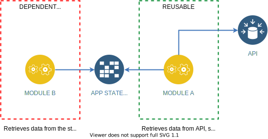
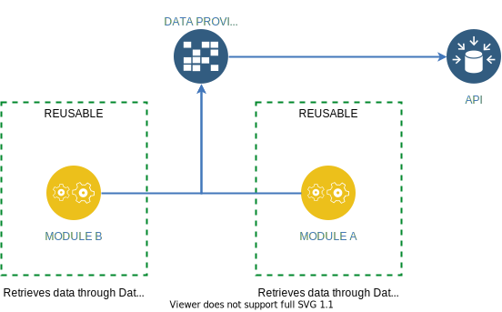
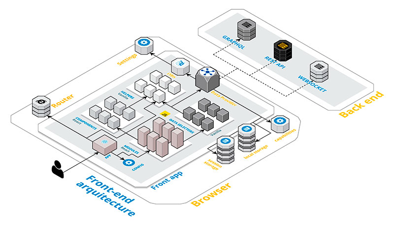

### Why you should not use your app state as a data cache

## The problem

As a front-end developer and what some call an &quot;architect&quot;, I've worked in very big projects, so I spent lot of time of last years trying to achieve a fully modular system in which the different front-end teams could __reuse elements across many applications__.

For simple components this is a relativelly easy job, but, when the elements are connected to data origins or to a global state _(what I usually call a &quot;module&quot;)_, then the thing changes, but why?...

In most cases, despite the fact of following recommended good practices and patterns _(very extended thanks to great tools and libraries like [React][react], [Redux][redux], [Reselect][reselect], etc.)_ the elements still were not 100% reusable. Some parts of its logic remained "coupled" to an upper level, which made almost impossible that ones could work without the others in a new and completely isolated environment.

## The causes

I realized that usually it was due to the fact that these elements were __delegating part of their responsibilities to another one__ without even realizing it. The other element normally is at charge of making a preliminary initialization, recovering certain data and setting it into the "state" _(a very usual example of this is the case where the user data are retrieved during the login phase, then saved into the state, and then accessed afterwards by a lot of elements which are presupposing that the data are always there, ready to be used)_

Most of times this is made simply because we want to optimize, save resources avoiding multiple calls to the server and unnecessary extra computations, but, following this pattern, we are __making our elements completely dependant__. Those elements can not be instantiated without the other ones, and they probably will require an specific load order to work properly. Which is worse, the first element is probably preparing or formatting the data in an specific way to which the rest of elements can be highly coupled. These "hidden" dependencies can easily propagate by the entire system without having notice, and, if you are not very careful, all the system becomes an indivisible and "monolithic" great piece of software. You could end working in an scenario in which hundred of invisible dependencies make almost impossible to remove, modify, or replace some elements _(guess which ones)_ without tons of pain, __that is the time when you can rename your project to "Domino blocks play".__

At the heart of the matter, __the problem is to use the global state as a cache for the data__, and, as it is "global", an orchestrator is needed to be at charge about when to retrieve the data, when to invalidate caches and retrieve the data again, etc. If there is no a clear "orchestrator", we usually delegate this responsibilities to the element that seems to be the responsible one _(as in the login example)_, but, doing this, __we are making dependant all the other elements needing some portion of the same data.__

## The solution

So, maybe the solution can be to __make every single element responsible of requesting always the data it needs__ _(connecting always them to the providers they want to read)_, and doing it __in the most granular way possible__, requesting only the data they want, and in the format they expect _(using specific selectors)_. Then, those selectors could be reused across many elements requiring the same data.

This solution simply is at charge of providing cache and memoization in order to __avoid unnecessary resources comsumption__, and to abstract the elements about the fact of from where are they reading the data. They don't need to know about the existance of an "API", or a "State", or "localStorage", or whatever. They simply need the data, it is the "data layer" which should be the one responsible of knowing about where the data are being retrieved or sended.

In this way, each element has __well defined dependencies__, and you can move them from one project to another _(or from one part of your project to another)_ without problem. The data will be requested and processed only when necessary, and only once (until the data decides that one cache has to be cleaned, then all of the elements connected to that data are informed about, so they can request it again).

## Concepts

As a summary, main targets of this project are:

- Separate global state from data cache.
- Force elements to always request for the data they need (but avoiding a negative performance impact due to usage of an internal cache).
- Make dependencies with the data clearly identifiable and traceable.
- Provide selectors allowing to combine data from different data origins or other selectors, keeping the same interface and principles.
- Inform elements when the cache of a provider is invalidated, so impacted elements can request the data again.
- Unify the interfaces of different data origins, in order to isolate the elements about the knowledge from where the data are being retrieved.
- Provide simple methods to handle loading and error states.

I hope that, __if this library does not result useful, at least these principles do, because this is the really important part of the project, more than the code itself.__ At the end, all patterns described here can be implemented using combinations of other tools. This project simply tries to facilitate the process.

[nodejs]: https://nodejs.org/en/
[redux]: https://redux.js.org/
[react]: https://reactjs.org/
[data-provider-react]: https://www.npmjs.com/package/@data-provider/react
[data-provider-axios]: https://www.npmjs.com/package/@data-provider/axios
[data-provider-browser-storage]: https://www.npmjs.com/package/@data-provider/browser-storage
[reselect]: https://github.com/reduxjs/reselect
